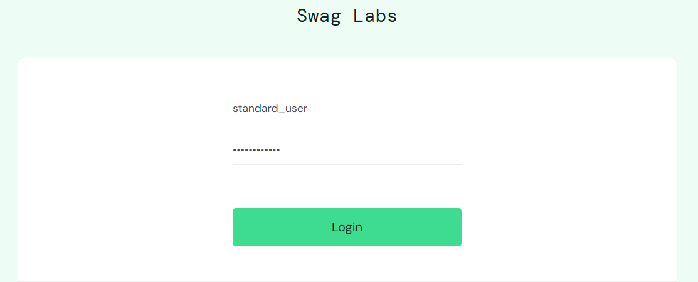
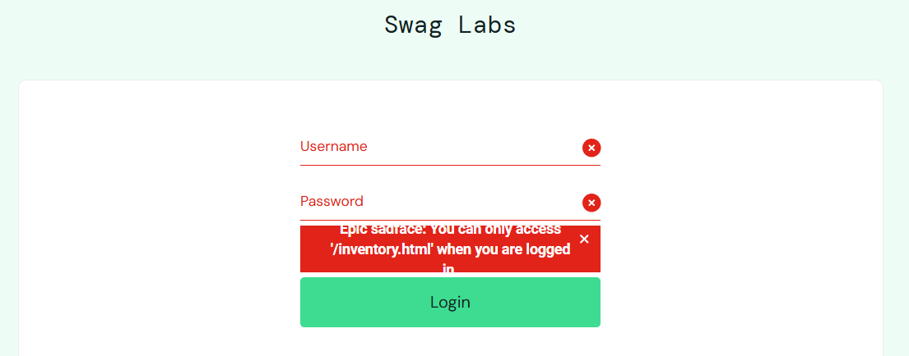
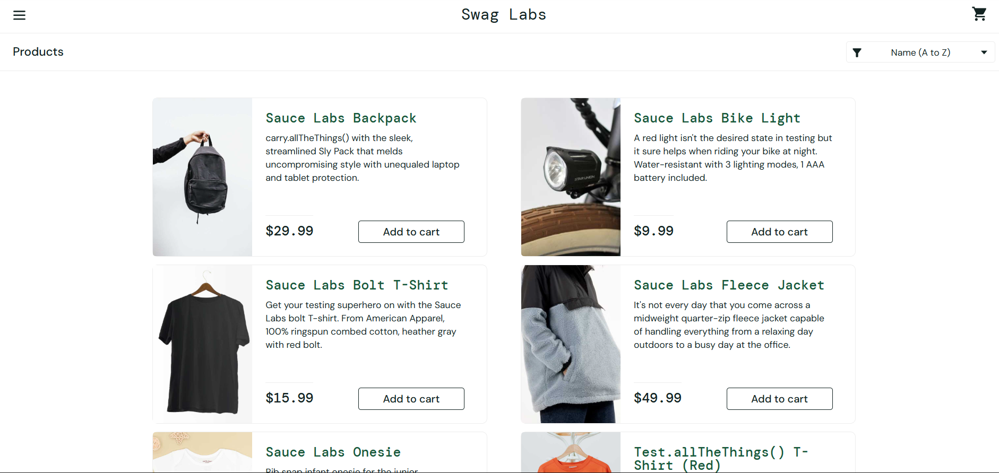
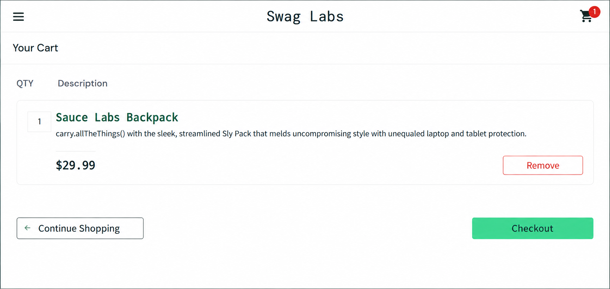
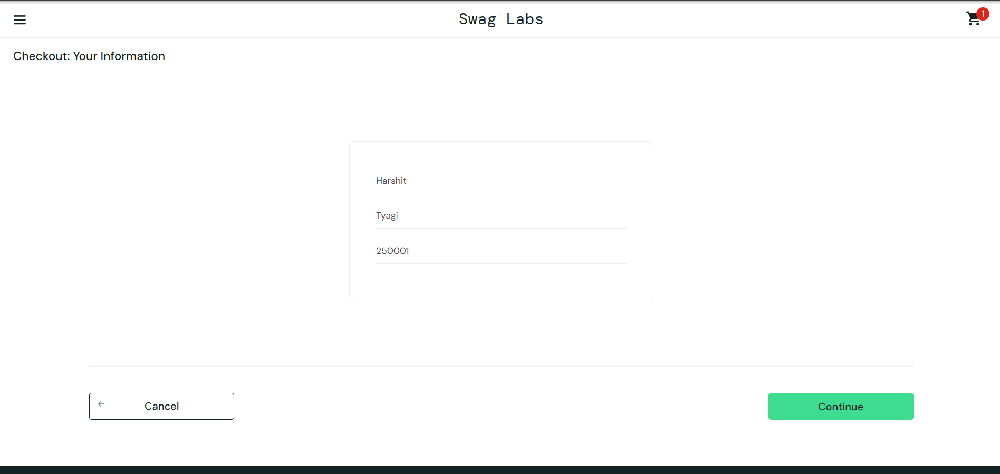
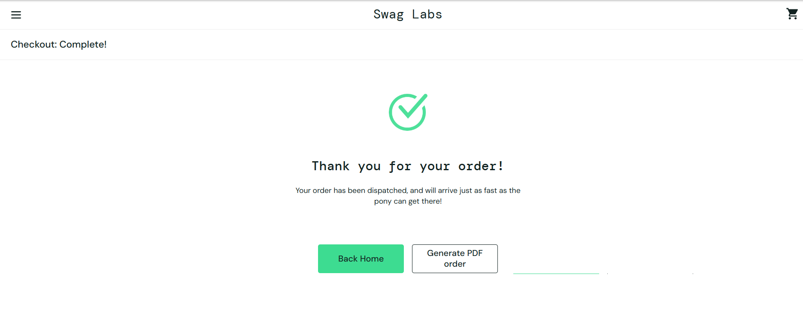

# 🛒 E-Commerce Hybrid Automation Framework

A **hybrid test automation framework** built with **Java, Selenium WebDriver, TestNG, Cucumber, REST Assured, and Maven** for testing an e-commerce application through both **UI automation** and **REST API automation**.

The framework uses the **Page Object Model (POM)** for maintainable UI automation and **Behavior-Driven Development (BDD)** with Cucumber/Gherkin for readable business scenarios.

---

## 📌 Table of Contents

- [Project Overview](#-project-overview)
- [Applications Under Test](#-applications-under-test)
- [Technology Stack](#-technology-stack)
- [Key Features](#-key-features)
- [Framework Architecture](#-framework-architecture)
- [UI Automation](#-ui-automation)
- [BDD with Cucumber](#-bdd-with-cucumber)
- [API Automation](#-api-automation)
- [Project Structure](#-project-structure)
- [Test Coverage](#-test-coverage)
- [Test Execution](#-test-execution)
- [Reporting](#-reporting)
- [Configuration](#-configuration)
- [Prerequisites](#-prerequisites)
- [How to Run](#-how-to-run)
- [Design Principles](#-design-principles)
- [Wipro Curriculum Alignment](#-wipro-curriculum-alignment)
- [Future Enhancements](#-future-enhancements)
- [Project Status](#-project-status)
- [Author](#-author)

---

# 📌 Project Overview

This project demonstrates a **hybrid automation framework** that combines:

1. **UI automation** using Selenium WebDriver and TestNG
2. **BDD automation** using Cucumber and Gherkin
3. **REST API automation** using REST Assured
4. **Build and test execution** using Maven
5. **Page Object Model** for reusable and maintainable UI code
6. **Automated reporting** through Cucumber and Maven/Surefire

The framework is designed around a realistic e-commerce workflow:

```text
Login
   ↓
Products
   ↓
Add Product
   ↓
Cart
   ↓
Checkout
   ↓
Customer Information
   ↓
Order Overview
   ↓
Order Complete
```

---

# 🌐 Applications Under Test

## 1. UI Application — SauceDemo

**Application:** SauceDemo  
**URL:** https://www.saucedemo.com/

SauceDemo is used as the e-commerce web application for UI automation.

### Main UI scenarios

- Valid login
- Invalid login
- Product selection
- Add product to cart
- Cart validation
- Checkout
- Order completion

### 📸 UI Screenshots

The following screenshots show the application pages covered by the automation flow.

### Login Page



### Invalid Login



### Products Page



### Cart Page



### Checkout Page



### Order Complete



---

## 2. API Application — DummyJSON

**API:** DummyJSON  
**Base URL:** https://dummyjson.com

DummyJSON is used for REST API automation with REST Assured.

### API operations covered

```text
GET     /products
GET     /products/{id}
GET     /products/search?q={query}
POST    /products/add
PUT     /products/{id}
DELETE  /products/{id}
```

> DummyJSON simulates several write operations. Therefore, POST, PUT, and DELETE tests validate the API responses rather than expecting permanent server-side changes.

---

# 🧰 Technology Stack

| Technology | Purpose |
|---|---|
| **Java** | Programming language |
| **Selenium WebDriver** | Browser/UI automation |
| **TestNG** | Test execution and assertions |
| **Cucumber** | BDD test automation |
| **Gherkin** | Human-readable test scenarios |
| **REST Assured** | REST API automation |
| **JSON / JSONPath** | API response validation |
| **Maven** | Build and dependency management |
| **Google Chrome** | Browser for UI automation |
| **Git** | Version control |
| **GitHub** | Source code hosting |

---

# ✨ Key Features

### UI Automation
- Browser automation with Selenium WebDriver
- Login validation
- Product and cart workflows
- Checkout automation
- Order completion validation

### TestNG
- Test execution
- Assertions
- `@BeforeMethod`
- `@AfterMethod`

### Page Object Model
- Separate page classes
- Reusable locators and actions
- Better test maintainability

### BDD / Cucumber
- Gherkin feature files
- Step definitions
- Cucumber hooks
- Test runner
- HTML reporting

### API Automation
- GET, POST, PUT, DELETE requests
- HTTP status-code validation
- JSON response validation
- JSONPath extraction

### Maven
- Dependency management
- Compilation
- Test execution
- Packaging

---

# 🏗️ Framework Architecture

The framework follows a layered design:

```text
                  E-COMMERCE HYBRID AUTOMATION FRAMEWORK
                                   │
                 ┌─────────────────┴─────────────────┐
                 │                                   │
                 ▼                                   ▼
          UI AUTOMATION                        API AUTOMATION
                 │                                   │
             Selenium                           REST Assured
                 │                                   │
              TestNG                           ProductApi
                 │                                   │
       Page Object Model                    JSON / JSONPath
                 │                                   │
                 └─────────────────┬─────────────────┘
                                   │
                                   ▼
                            Maven Test Execution
                                   │
                                   ▼
                              Test Reports
```

---

# 🖥️ UI Automation

The UI layer follows the **Page Object Model (POM)**.

## UI execution flow

```text
LoginTest
    │
    ▼
LoginPage
    │
    ▼
ProductsPage
    │
    ▼
CartPage
    │
    ▼
CheckoutPage
    │
    ▼
Selenium WebDriver
    │
    ▼
Chrome Browser
    │
    ▼
SauceDemo
```

## Page Objects

| Class | Responsibility |
|---|---|
| `LoginPage` | Username, password, login action, invalid-login validation |
| `ProductsPage` | Product selection, add-to-cart, cart navigation |
| `CartPage` | Cart validation and checkout navigation |
| `CheckoutPage` | Customer details, checkout navigation, order completion |

---

# 🔄 BDD with Cucumber

Cucumber is used for **Behavior-Driven Development**.

The BDD flow is:

```text
Feature File
     ↓
Gherkin Scenario
     ↓
Step Definitions
     ↓
Page Object
     ↓
Selenium WebDriver
     ↓
Web Application
```

## Example scenario

```gherkin
Feature: User Login

  Scenario: Successful login with valid credentials

    Given the user is on the login page
    When the user enters valid username and password
    And the user clicks the login button
    Then the user should be redirected to the inventory page
```

## Cucumber components

```text
src/test/resources/features/
└── login.feature

src/test/java/com.wipro.automation.steps/
├── LoginSteps.java
└── CucumberHooks.java

src/test/java/com.wipro.automation.runners/
└── CucumberTest.java
```

---

# 🔌 API Automation

The API layer separates request handling from test validation.

```text
ProductApiTest
       │
       ▼
   ProductApi
       │
       ▼
 REST Assured
       │
       ▼
 DummyJSON API
       │
       ▼
 JSON Response
       │
       ▼
 Assertions / JSONPath
```

## API validations

The framework validates:

- HTTP status codes
- Response body
- Product ID
- Product title
- Search results
- JSON fields
- Delete confirmation

---

# 📁 Project Structure

```text
ecommerce-hybrid-automation-framework/
│
├── src/
│   │
│   ├── main/
│   │   ├── java/
│   │   │   └── com.wipro.automation/
│   │   │       ├── api/
│   │   │       │   └── ProductApi.java
│   │   │       │
│   │   │       ├── pages/
│   │   │       │   ├── LoginPage.java
│   │   │       │   ├── ProductsPage.java
│   │   │       │   ├── CartPage.java
│   │   │       │   └── CheckoutPage.java
│   │   │       │
│   │   │       └── utils/
│   │   │
│   │   └── resources/
│   │       └── config.properties
│   │
│   └── test/
│       ├── java/
│       │   └── com.wipro.automation/
│       │       ├── base/
│       │       │   └── BaseTest.java
│       │       │
│       │       ├── runners/
│       │       │   └── CucumberTest.java
│       │       │
│       │       ├── steps/
│       │       │   ├── CucumberHooks.java
│       │       │   └── LoginSteps.java
│       │       │
│       │       └── tests/
│       │           ├── LoginTest.java
│       │           ├── CheckoutTest.java
│       │           └── ProductApiTest.java
│       │
│       └── resources/
│           └── features/
│               └── login.feature
│
├── docs/
│   └── screenshots/
│       ├── login-page.png
│       ├── invalid-login.png
│       ├── products-page.png
│       ├── cart-page.png
│       ├── checkout-page.png
│       └── order-complete.png
│
├── pom.xml
├── .gitignore
└── README.md
```

---

# 🧪 Test Coverage

The current framework executes **10 automated tests**.

## UI / TestNG — 3 tests

| ID | Test Case |
|---|---|
| UI-01 | Valid Login |
| UI-02 | Invalid Login |
| UI-03 | Complete Checkout Flow |

## Cucumber — 1 scenario

| ID | Scenario |
|---|---|
| BDD-01 | Successful Login with Valid Credentials |

## API / REST Assured — 6 tests

| ID | Test Case |
|---|---|
| API-01 | Get All Products |
| API-02 | Get Product by ID |
| API-03 | Search Products |
| API-04 | Add Product |
| API-05 | Update Product |
| API-06 | Delete Product |

---

# ▶️ Test Execution

The full suite can be executed using Maven.

## Compile

```bash
mvn compile
```

## Run all tests

```bash
mvn test
```

## Package the project

```bash
mvn package
```

---

# ✅ Latest Test Result

The latest successful execution produced:

```text
Tests run: 10
Failures: 0
Errors: 0
Skipped: 0

BUILD SUCCESS
```

---

# 📊 Reporting

The framework generates test results through Maven/Surefire and Cucumber.

### Cucumber HTML Report

```text
target/cucumber-report.html
```

### Surefire Reports

```text
target/surefire-reports/
```

These reports provide information about:

- Total tests
- Passed tests
- Failed tests
- Skipped tests
- Execution details
- Cucumber scenario results

---

# ⏳ Synchronization

The UI automation uses Selenium synchronization mechanisms to improve stability.

Current techniques include:

- Implicit waits
- Explicit waits
- `WebDriverWait`
- Expected Conditions

These are used for element visibility, page transitions and dynamic UI updates.

---

# ⚙️ Configuration

Application configuration is maintained separately in:

```text
src/main/resources/config.properties
```

Example:

```properties
browser=chrome
ui.base.url=https://www.saucedemo.com/
api.base.url=https://dummyjson.com
```

This keeps application URLs and runtime configuration separate from test logic.

---

# 🧱 Design Principles

### Separation of Concerns

Test logic, page interactions and API request handling are separated into dedicated classes.

### Reusability

Common browser setup and reusable page methods are shared between tests.

### Maintainability

Locators and page-specific actions are maintained inside Page Object classes.

### Readability

Cucumber feature files describe business scenarios using readable Gherkin syntax.

### Scalability

New pages, API modules and feature files can be added without redesigning the existing framework structure.

---

# 🚀 How to Run the Project

## Prerequisites

Install:

- Java JDK
- Maven
- Eclipse IDE or another Java IDE
- Google Chrome
- Git

Verify Java:

```bash
java -version
```

Verify Maven:

```bash
mvn -version
```

## Clone the repository

```bash
git clone <YOUR_GITHUB_REPOSITORY_URL>
```

Navigate to the project:

```bash
cd ecommerce-hybrid-automation-framework
```

Run the complete test suite:

```bash
mvn test
```

---

# 🔮 Future Enhancements

Possible future improvements:

- Parallel test execution
- Cross-browser testing
- Data-driven testing
- Additional Cucumber scenarios
- API authentication scenarios
- Additional API coverage
- Screenshot capture on test failure
- Advanced reporting
- Jenkins / CI-CD integration
- Multiple environment support
- Mobile automation using Appium


---

# 👨‍💻 Author

**Harshit Tyagi**  
B.Tech Computer Science & Engineering (AI & ML)

---

